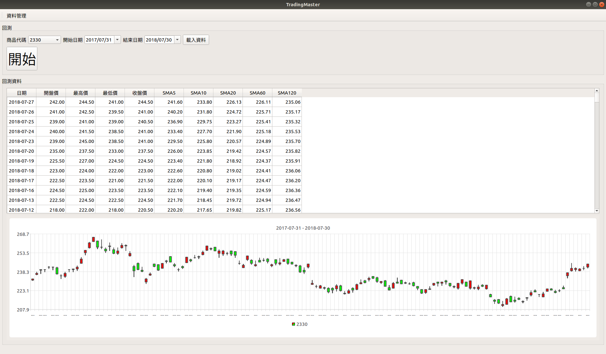
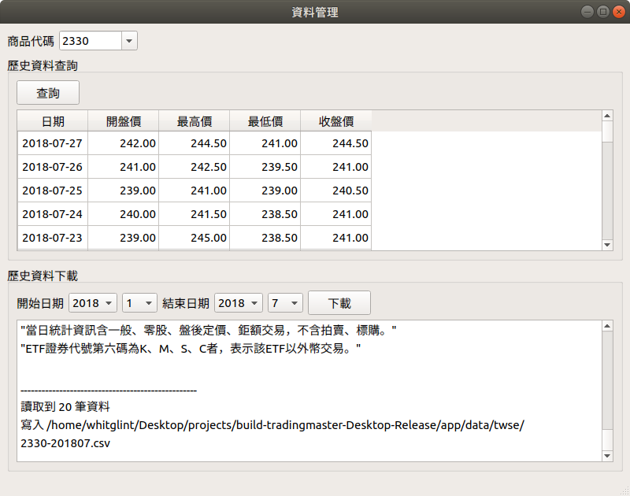

# TradingMaster

目標是開發一套能用各種程式語言來寫策略的程式交易平台。

## Build

* C++14 compiler
* Qt (Charts)

## Usage

1. 點進「資料管理」。
2. 輸入商品代碼(例如 2330)、選擇開始日期和結束日期，點下載按鈕開始下載價格資料。
3. 關閉資料管理視窗。
4. 選擇商品代碼、開始日期和結束日期，點載入資料按鈕。
5. 點開始按鈕進行回測。(尚未完成)

## Screenshots

## Todos

* 回測功能
* 使用 GraalVM 執行策略
* 更多資料來源

## License

GPL
